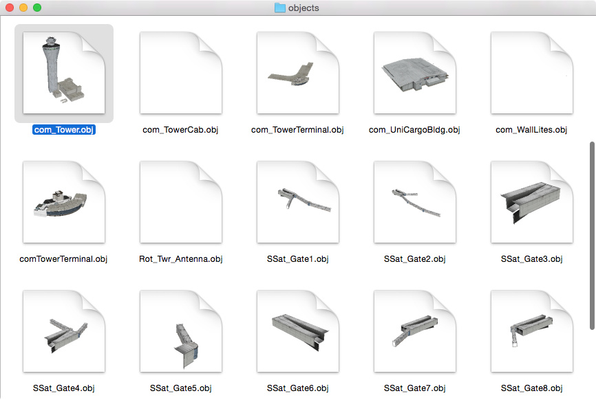
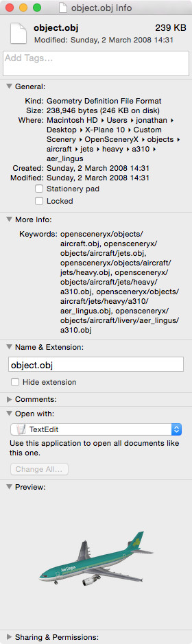
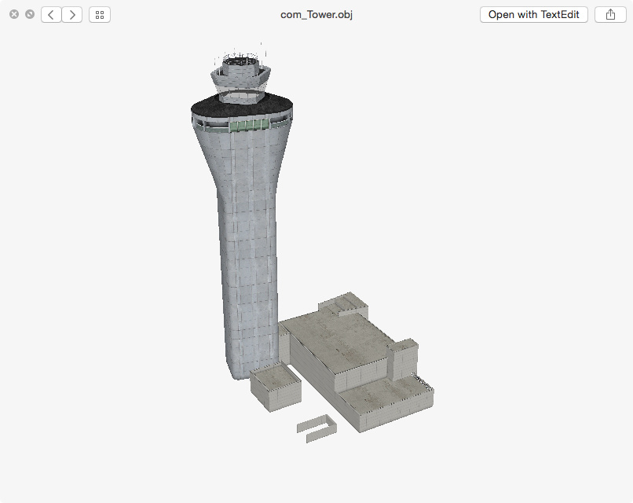
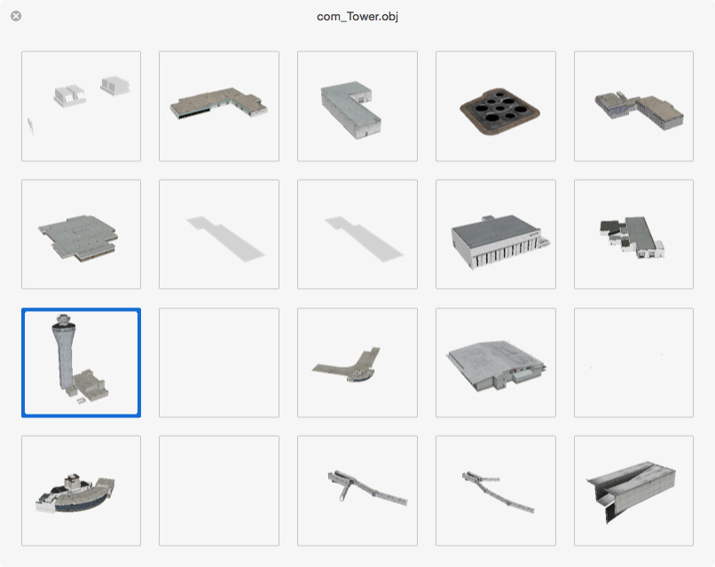

QuickLook XPlane Object
=======================

This package allows Finder on OSX 10.7 and later to display thumbnails and QuickLook previews for [X-Plane](http://www.x-plane.com) 3D Object files.

Installation
------------
* Download the `.pkg` file of the [latest release](https://github.com/Marginal/QLXPlaneObj/releases/latest).
* Double-click on it.
* The Installer app will walk you through the installation process.
* To see thumbnails you may need to relaunch Finder (ctrl-⌥-click on the Finder icon in the Dock and choose Relaunch) or log out and back in again.
* You may experience high disk usage for a few minutes after installation while Spotlight re-indexes all of your X-Plane objects.

Screenshots
-----------
   

Uninstall
---------
* Run the Terminal app (found in Applications → Utilities).
* Copy the following and paste into the Terminal app:

        sudo rm -rf "/Library/Application Support/QLXPlaneObj" "/Library/QuickLook/XPlaneObj.qlgenerator" "/Library/Spotlight/XPlaneObj.mdimporter"

* Press Enter.
* Type your password and press Enter.

Acknowledgements
----------------
* Uses [xptools](https://github.com/X-Plane/xptools) © Laminar Research, licensed under the MIT/X11 license.
* Packaged using [Packages](http://s.sudre.free.fr/Software/Packages/about.html).

License
-------
Copyright © 2016 Jonathan Harris.

Licensed under the [GNU Public License (GPL)](http://www.gnu.org/licenses/gpl-2.0.html) version 2 or later.

